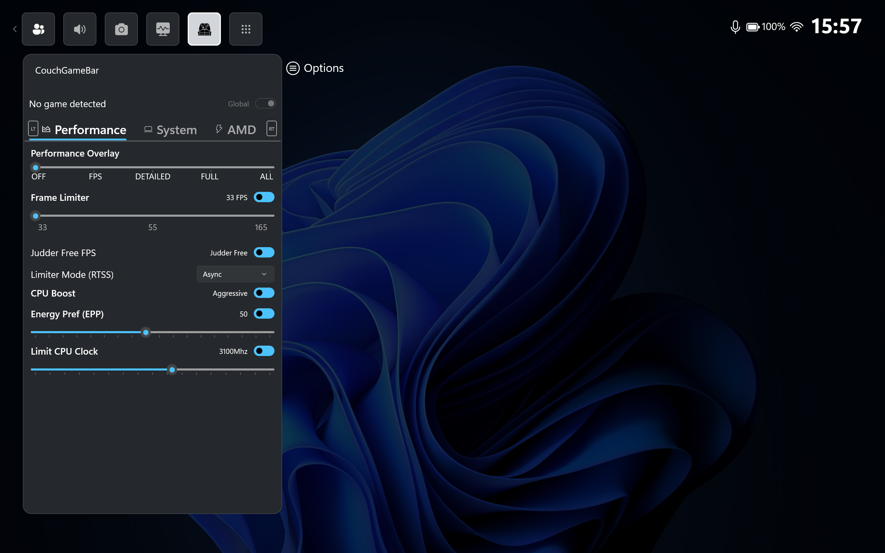

# GameTweakBar

## What is it?

GameTweakBar is a helper tool for gamers to control all gaming-related settings using the gamepad/game controller.
GameTweakBar is built as an Xbox Game Bar widget as the frontend, and a Win32 helper as the backend tool.
It's a fork from this project: https://github.com/namquang93/XboxGamingBar, which I'm iterating on.

## Vision
The vision is to create a compact, user friendly, and fully featured tool for sofa gamers to control a plethora of settings with a controller.
It is aimed at both AMD and Intel/NVIDIA users, both Desktop and Laptop computers.  
It is NOT aimed at Handheld devices, for which alternative projects already exist and are pretty mature. Although it will work without issues.

PC gaming can be complex, so effort is put into making settings easy to understand, with sensible defaults and easily reversible

## Features

As of now, there are the following functions:

### Performance Control
- Performance Overlay using RivaTuner Statistics Server OSD.
- Extensive options for RTSS frame limiting
- Per-game Profile.
- CPU performance adjustments.
  - Enable or disable CPU Boost.
  - Set CPU Energy Performance Preference (EPP).
  - Set CPU clock speed limit.
- Frame limiter 

### Quick System Settings
- Quickly change screen refresh rate and resolution.
- Binding gamepad keys to some system functions.
  - Lossless Scaling hotkey.

### AMD Settings
  - Radeon Super Resolution.
  - AMD Fluid Motion Frame.
  - Radeon Anti-Lag.
  - Radeon Boost.
  - Radeon Chill.

## Installation

### Step 1: Install the Security Certificate (.cer)
Sideloaded Windows packages are signed with a security certificate. You must add the certificate to your system's trusted store once:

Extract the downloaded release .zip file.
Locate and double-click the certificate file (.cer).
Click Install Certificate...
Select Local Machine (requires Administrator) and click Next.
Select Place all certificates in the following store.
Click Browse... and select Trusted People (or Trusted Root Certification Authorities).
Click OK > Next > Finish.
A message will appear saying: "The import was successful."

### Step 2: Install the App Package
Option A: Using the Automated PowerShell Script (Recommended)
In the extracted folder, right-click Add-AppDevPackage.ps1.
Select Run with PowerShell.
If prompted for execution policy, press Y and Enter.
Follow the on-screen prompts until installation completes.

Xbox Gaming Bar is 100% free and open source. It's built upon C#.
Libraries used:
- **[LibreHardwareMonitor](https://github.com/LibreHardwareMonitor/LibreHardwareMonitor)** for performance statistics overlay.
- **[RyzenAdj](https://github.com/FlyGoat/RyzenAdj)** for AMD TDP control.
